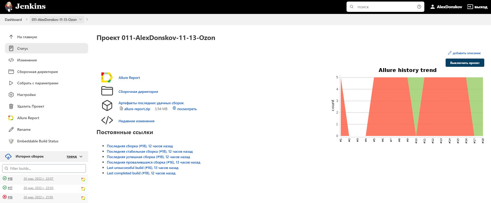

# Проект по автоматизации тестирования интернет-магазина Ozon
## <a target="_blank" href="https://www.ozon.ru/">Веб сайт Acron</a>

## :floppy_disk: Содержание:

- <a href="#computer-технологии-и-инструменты">Технологии и инструменты</a>
- <a href="#printer-реализованные-проверки">Реализованные проверки</a>
- <a href="#electric_plug-сборка-в-Jenkins">Сборка в Jenkins</a>
- <a href="#desktop_computer-запуск-из-терминала">Запуск из терминала</a>
- <a href="#shinto_shrine-allure-отчет">Allure отчет</a>
- <a href="#shinto_shrine-интеграция-с-allure-testops">Интеграция с Allure TestOps</a>
- <a href="#shinto_shrine-интеграция-с-jira">Интеграция с Jira</a>
- <a href="#shinto_shrine-отчет-в-telegram">Отчет в Telegram</a>
- <a href="#shinto_shrine-видео-примеры-прохождения-тестов">Видео примеры прохождения тестов</a>

## :computer: Технологии и инструменты
<p align="center">


</p>

## :printer: Реализованные проверки
- Проверка наличия надписи Ozon
- Переход по каталогу в раздел Смартфоны
- Проверка поиска
- Проверка ссылок в хедере Ozon Travel
- Добавление товара в корзину

## :electric_plug: Сборка в Jenkins
### <a target="_blank" href="https://jenkins.autotests.cloud/job/011-AlexDonskov-11-13-Ozon/">Сборка в Jenkins</a>
<p align="center">

</p>  

## :desktop_computer: Запуск из терминала
Локальный запуск:
```
gradle clean test
```

Удаленный запуск:
```
clean
test
-Duser=${USER}
-Dpassword=${PASSWORD}
-Dbrowser=${BROWSER}
-DremoteBrowser=${REMOTE_BROWSER}
-Dversion=${VERSION}
-Dsize=${BROWSER_SIZE}
-Dthreads=${THREADS}
```
Исправить